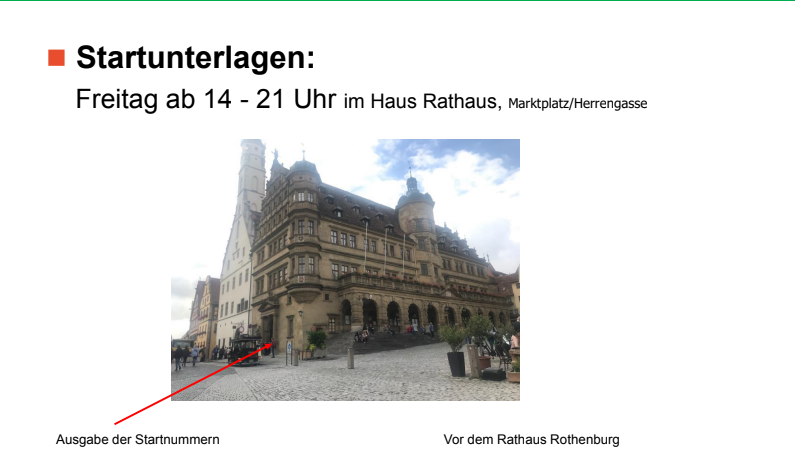
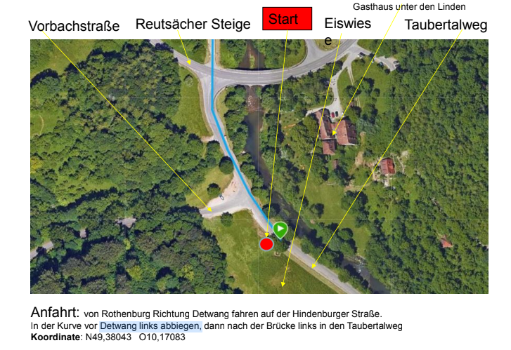
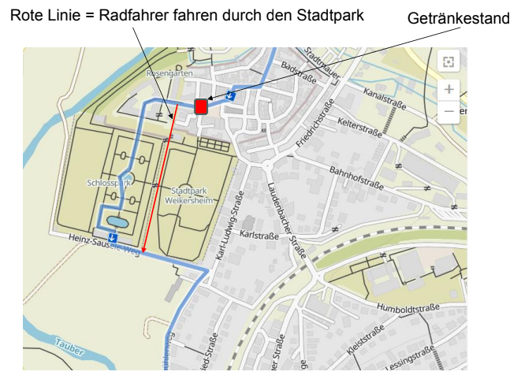
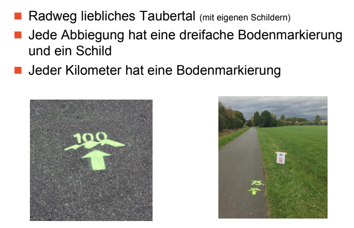
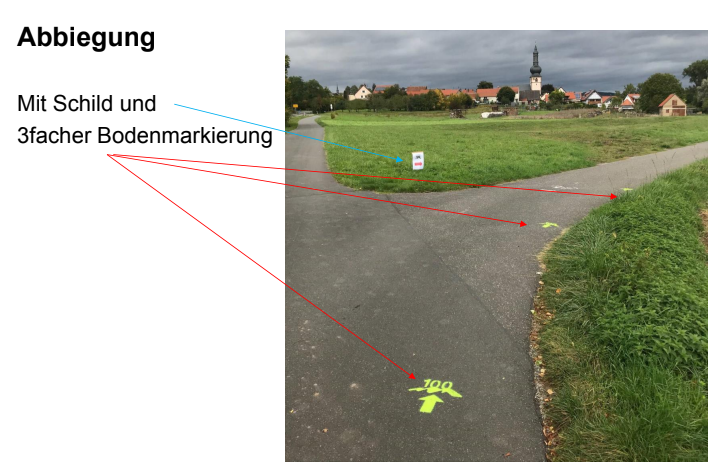

# Ablauf Ultra-Marathon

Timeline mit wichtigen Informationen für den Ultra.
Die gesamte Präsentation vom Briefing befindet sich [hier](./Briefing.pdf).

## Donnerstag - 03.10.2024 - Ankommen

- Ankunft bei Oma gegen Nachmittag
- Entspannen und nichts tun

## Freitag - 04.10.2024 - Setup und Mental ~~Breakdown~~ **Relaxing**

### Rolfs auto

- Rolf (Jochens Bruder) stellt freundlicherweise sein Auto zur verfügung
- Gegen Mittag abholen und Fahrradhalterung prüfen
    - gegebenenfalls bereits das Fahrrad schon befestigen
    - alternativ am Samstag früh

### Startunterlagen

- Abholung zwischen 14 Uhr und 21 Uhr

#### Voraussetzungen (mitzunehmen beim Check-In)

- [Zahlungsbestätigung](./Zahlungsbestaetigung.pdf)
- [Startnummer](./Teilnehmerliste%202024%20Taubertal%20100.pdf) (**49**)
- [Verzichtserklärung](./Verzichtserklärung%20und%20Haftungsfreistellung%20VuH.pdf)
- [Teilnahmebedingung](./Teilnahmebedingungen%20TB.pdf)

### Ausrüstung vorbereiten

- **roter Drop Back**
    - Schue
    - Socken
    - hose
    - tshirt
    - was langärmliges
    - creme (falls reibungsprobleme da sind)
    - blasenpflaster für füße und haut allg.

- **Laufrucksack**
    - Energiegels
    - Pflaster
    - Trinkblase
    - Notfalldokumente (Ausweis etc.)
    - Powerbank
    - was langärmliges (in handtuch vll eingewickelt für schweißabweisung vom Rücken)
    - stirnlampe
    - ersatzbatterien

- **laufunterlagen (inkl. laufschnalle)**

- **gps-tracker mit tragegurt**

- **gepäck max 10 kg (Bjarne und Rebecca)**
    - wechselklamotten
    - shampoo
    - handtücher
    - schuhe

### Abend-Event

#### Location: [Hotel Rappen](https://maps.app.goo.gl/DHtS3cArkF6CneBU8)

- Kartoffelparty um 18 Uhr
- Vortrag 19:30 Uhr - 21 Uhr "Dieter Baumann läuft"

### Sonstiges

- Sightseeing (Alle?)
- Einkaufen (Merten?)
    - Toastbrot
    - Bananen
    - Erdnussbutter
    - Hafermilch
    - Essen für Rebecca, Merten und Bettina am Samstag

## Samstag 05.10.2024 - Der Lauf

### Vor dem Lauf

- [Tracking](https://www.geotracks.co.uk/live/Taubertal100-2024)
- 4 Uhr aufstehen
    - Kaffee und einmal ordentlich aufs Klo!
- 4:30 Uhr - 5:15 Uhr Uhr abgabe Dropback und Gepäck in [Hotel Rappen](https://maps.app.goo.gl/DHtS3cArkF6CneBU8)
- 5:15 Uhr GPS einschalten (schalter drei Sekunden lang drücken)
- 5:25 Uhr Lauf vom Rappen zum [Start](https://maps.app.goo.gl/jucyVvo7TbkiAyTm9)
    - lauf geht durch die Altstadt zur Eiswiese
    - 5:35 Uhr Beauftragung als Botenläufer im Burggarten
    - Für Auto gilt folgende [Route](https://maps.app.goo.gl/TSbAaAiy3gDURFGW6) 

- 6 Uhr Start

### Während des Laufes

#### Regeln

- **KEINE HILFE ODER FREMDEINWIRKUNG**
- **IMMER MINDESTENS ZWEI METER ABSTAND**
- Begleiter darf beim Checkpoint Verpflegung anreichen

#### Streckenverlauf

- Strecke
  für [Maps](https://www.google.com/maps/d/viewer?mid=1q6d6qUg0AwhIK_OyF-TyUw848k6brwWA&ll=49.72055058472038%2C9.840644679976238&z=10)
- Strecke für [Kamoot](https://www.komoot.com/de-de/tour/374784632)

#### Streckendetails

- Rebecca stößt an KM 18 dazu ([maps](https://maps.app.goo.gl/DgcJyYyvfDY6uMnR8))
    - Achtung bei Schloss Weikersheim, Fahrradfahrer müssen vorher links
      abbiegen 

##### Markierungen beachten

- Für Auto
    - Die Landstraße "Romantische Straße" verläuft neben der Laufstrecke von Rothenburg nach Wertheim. Ein Begleitung
      der
      Läufer an den Checkpoints ist somit sehr gut möglich

### Nach dem Lauf

- Duschen
- Essen
- Auf Leben klarkommen
